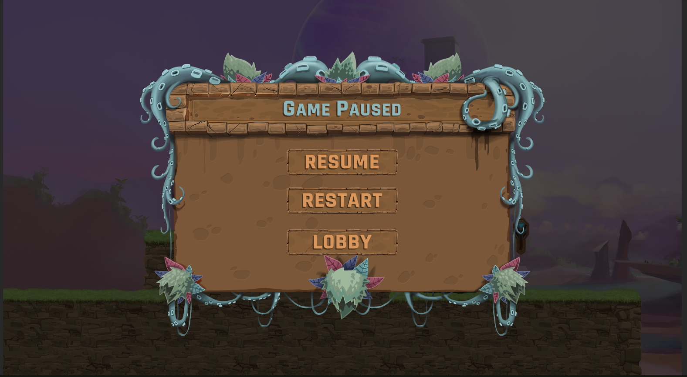

# 2D-Platformer-Game
The 2D platformer game to be forked something like mario its a clean repo made for LTS version

# Instructions for the game
- Player movement using WASD keys.
- Shoot Bullets using Left Mouse Button.

# Implementation and Design Patterns Used
- Use of unity physics and collisions for implementing player mechanics.
- Added different types of collectibles.
- Added level win conditions.
- Working Level and Basic Sound System.
- Basic UI covered such as pause, restart, resume, and quit Game.

